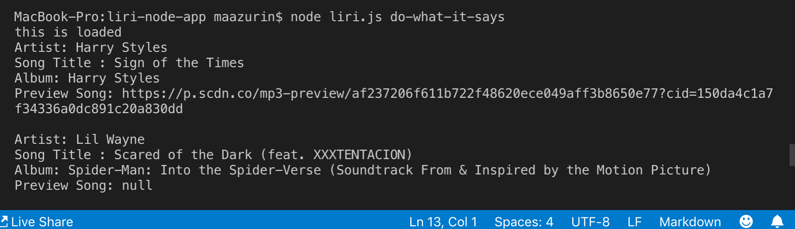
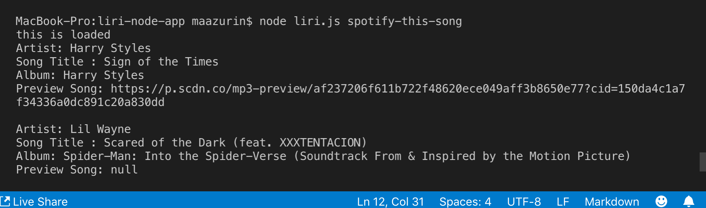
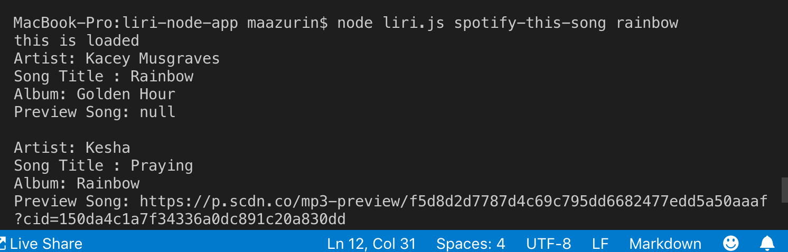
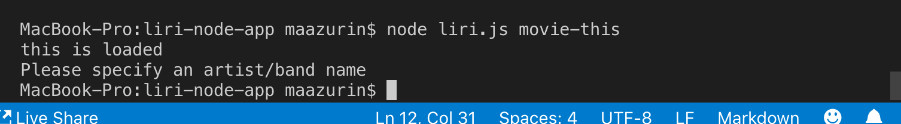
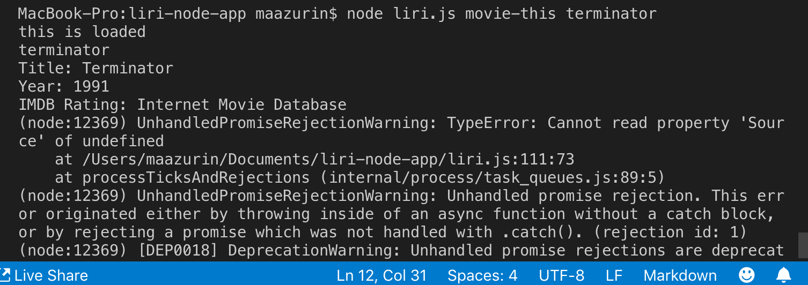

# liri-node-app

This app is used to help retrieve information of songs and movie using existing APIS using the following technologies in nodeJS: axios, moment, dotenv and fs.

To run the app, you need install these packages by typing 
npm i

Here is an example to run the following commands:

node liri.js do-what-it-says
;

node liri.js concert-this
;
;

node liri.js spotify-this-song
;
;

node liri.js movie-this":
;
;